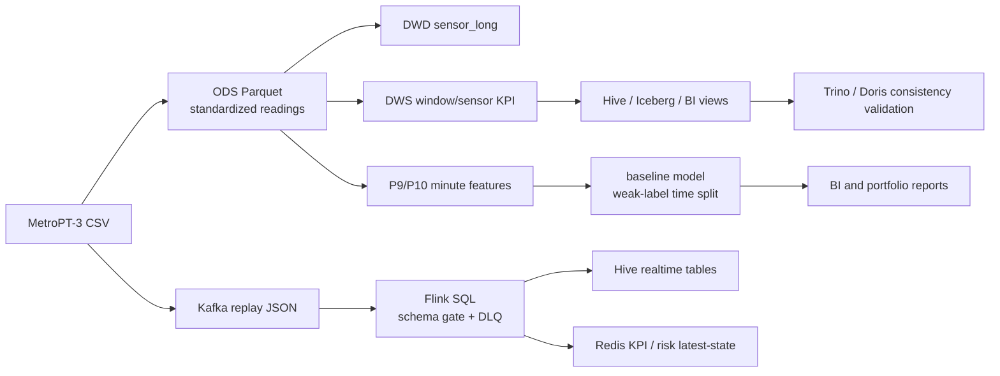

# MetroPT-3 Industrial Equipment Predictive Maintenance Data Platform

Language / 语言: [中文](README_zh.md) | [English](README_en.md)

This is a portfolio project built around the **MetroPT-3 Dataset**. It ingests air-compressor sensor CSV data into a big-data platform and produces an offline lakehouse pipeline, real-time replay, risk scoring, query validation, BI materials, and delivery evidence.

The project has a single business domain: `metropt_quality`.

## Dataset Source

This repository does not commit the raw MetroPT-3 CSV/PDF dataset files. Download the dataset from the official source and follow the original site's license, citation, and usage requirements:

- UCI Machine Learning Repository: [MetroPT-3 Dataset](https://archive.ics.uci.edu/dataset/791/metropt+3+dataset)

After download, place the files under the local `datas/` directory, for example:

```text
datas/MetroPT3_AirCompressor.csv
datas/Data Description_Metro.pdf
```

## What This Project Does

The MetroPT-3 data comes from a train air-compressor Air Production Unit. It contains 1Hz multivariate time-series data from February 2020 to August 2020. This project covers:

| Capability | Description |
| --- | --- |
| Offline pipeline | CSV -> ODS Parquet -> DWD sensor long -> DWS KPI -> Hive/Iceberg -> BI views |
| Real-time pipeline | CSV replay -> Kafka -> Flink -> Hive realtime tables / Redis KPI |
| Risk scoring | Flink signal-proxy risk scorer outputs `risk_score`, `risk_level`, and `risk_reason` |
| Analysis and modeling | EDA, weak labels, minute features, baseline model, and warehouse-derived feature parity |
| Query layer | Hive, Trino, and Doris query samples with consistency validation against Hive |
| Delivery evidence | P7 ops snapshot, P14 master validation, delivery package, and Chinese technical documentation |

Current status: the project is deliverable, demo-ready, and reproducible. The latest formal standard P14 validation evidence from 2026-06-09 is `PASS`, with `pass=18 warn=0 skip=0 fail=0`.

## Where To Start

Recommended reading order:

1. `README_en.md`: project goal, quick start, directory entry points, and key evidence.
2. `MetroPT-3虚拟机测试执行清单.md`: test steps and acceptance criteria for the three-node virtual-machine cluster.
3. `项目接口文档.md`: script, data, Hive, Kafka, Redis, Doris, and Trino interfaces.
4. `通用大数据流程配置.md`: base big-data platform components, startup order, and common configuration.
5. `src/README.md`: offline Spark / Hive / Iceberg pipeline.
6. `streaming/README.md`: Kafka replay, Flink KPI, and Flink risk scoring.
7. `analysis/README.md`: data quality, multidimensional analysis, P9/P10 features, and baseline model.
8. `bin/README.md`: cluster startup, inspection, validation, and delivery scripts.
9. `data/metropt_quality/README.md`: run outputs, logs, reports, figures, and validation runs.
10. `api/README.md`: FastAPI demo entry point and service boundary.
11. `tests/README.md`: lightweight local tests that do not depend on the cluster.

## Architecture Overview



## Quick Start

### Local Lightweight Reading

If you only need to inspect code and documentation, the cluster is not required:

```powershell
cd <repo-root>
```

Key files:

```text
README.md
MetroPT-3虚拟机测试执行清单.md
项目接口文档.md
通用大数据流程配置.md
src/README.md
streaming/README.md
analysis/README.md
bin/README.md
data/metropt_quality/README.md
api/README.md
tests/README.md
```

### Local Analysis Preflight

Local config:

```text
config/metropt_quality.local.yaml
```

Local raw data:

```text
datas/MetroPT3_AirCompressor.csv
datas/Data Description_Metro.pdf
```

Lightweight check commands:

```powershell
python bin/local_code_quality_check.py
python analysis/00_validate_analysis_inputs.py
```

### Cluster Reproduction Entry

Remote project root:

```bash
/home/common/tmp/pycharm_Design
```

Cluster config:

```bash
/home/common/tmp/pycharm_Design/config/metropt_quality.cluster.yaml
```

Enter the project:

```bash
cd /home/common/tmp/pycharm_Design
source /etc/profile.d/bigdata.sh
export METROPT_CONFIG=/home/common/tmp/pycharm_Design/config/metropt_quality.cluster.yaml
```

Run a read-only inspection first:

```bash
bin/p7_ops_snapshot.sh
```

Daily smoke check:

```bash
bin/p10_p9_master_validation.sh --mode smoke
```

Formal standard validation:

```bash
bin/p10_p9_master_validation.sh \
  --mode standard \
  --allow-swapoff \
  --realtime-max-events 1000 \
  --realtime-wait-seconds 60 \
  --query-timeout 300
```

Note: `smoke` records explicit SKIP items. It can show that the basic pipeline is roughly available, but it cannot replace standard validation.

## Usage Examples

Run the full offline pipeline `00 -> 06`:

```bash
python src/run_metropt_offline.py
```

Run only up to DWS:

```bash
python src/run_metropt_offline.py --stop-after 04_metropt_kpi_calc.py
```

Output directory:

```text
data/metropt_quality/logs/<run_id>/
```

Start with:

```text
offline_run_summary.tsv
```

Run analysis and modeling:

```bash
python analysis/00_validate_analysis_inputs.py
python analysis/run_metropt_analysis.py
```

Output directories:

```text
data/metropt_quality/analysis/reports/
data/metropt_quality/analysis/figures/
data/metropt_quality/analysis/models/
data/metropt_quality/analysis/logs/
```

Chinese reports use the `*.zh.md` filename pattern, while English originals are kept without overwrite.

If you only need to explain existing model artifacts without retraining:

```bash
python analysis/11_model_explainability_summary.py
```

Outputs:

```text
data/metropt_quality/analysis/models/p11_model_explainability_summary.json
data/metropt_quality/analysis/reports/p11_model_explainability_summary.md
```

Dry-run real-time replay to inspect JSON fields:

```bash
python streaming/metropt_replay_to_kafka.py \
  --config /home/common/tmp/pycharm_Design/config/metropt_quality.cluster.yaml \
  --dry-run \
  --print-sample 3 \
  --max-events 3
```

Send a small batch to Kafka:

```bash
python streaming/metropt_replay_to_kafka.py \
  --config /home/common/tmp/pycharm_Design/config/metropt_quality.cluster.yaml \
  --rate 500 \
  --batch-size 500 \
  --max-events 10000
```

Run the real-time demo validation entry:

```bash
bin/p6_realtime_demo_mode.sh --start --duration-minutes 0 --max-events 1000 --rate 500 --wait-seconds 60
```

Run query-layer validation:

```bash
bin/p12_query_layer_validation.sh --allow-swapoff
```

Output directory:

```text
data/metropt_quality/validation_runs/p12_query_layer_validation_<run_id>/
```

Key files:

```text
summary.tsv
p12_query_results.tsv
p12_consistency.tsv
```

Build a local demo sample without copying the full raw data:

```powershell
python bin/build_metropt_sample.py --rows 1000
```

Build a compact portfolio package:

```powershell
python bin/build_portfolio_package.py
```

The package copies only README files, technical documents, key reports, and demo entries. It does not copy raw CSV, Parquet, logs, or service data.

Run the API demo:

```powershell
pip install -r requirements.txt
uvicorn api.metropt_portfolio_api:app --host 127.0.0.1 --port 8000
```

This is a portfolio demo. It does not connect to Redis, Hive, Trino, or Doris, and it is not a production serving system.

## Configuration

| File | Purpose |
| --- | --- |
| `config/metropt_quality.local.yaml` | Local development and lightweight validation, pointing to the local CSV |
| `config/metropt_quality.cluster.yaml` | Three-node cluster runtime, pointing to HDFS, Kafka, Hive, Redis, and other services |

Core paths:

| Type | Path |
| --- | --- |
| Windows project root | `<repo-root>` |
| Remote project root | `/home/common/tmp/pycharm_Design` |
| Local CSV | `<repo-root>\datas\MetroPT3_AirCompressor.csv` |
| HDFS CSV | `hdfs:///lakehouse/projects/metropt_quality/raw/MetroPT3_AirCompressor.csv` |
| Validation results | `data/metropt_quality/validation_runs/` |
| Delivery packages | `data/metropt_quality/delivery_packages/` |

## File Index

| Path | Purpose |
| --- | --- |
| `src/` | Main offline Spark / Hive / Iceberg pipeline |
| `streaming/` | Kafka replay, Flink KPI, and Flink risk scoring |
| `analysis/` | Data quality, multidimensional analysis, P9/P10 features, and baseline model |
| `bin/` | Cluster startup, inspection, validation, and delivery scripts |
| `api/` | FastAPI portfolio demo for a service-oriented extension |
| `tests/` | Lightweight unittest suite that does not depend on the cluster |
| `data/metropt_quality/` | Run outputs, reports, figures, models, logs, validation runs, and delivery packages |
| `config/` | Local and cluster configuration |
| `Optimize/` | Optimization summary and troubleshooting notes |
| `MetroPT-3虚拟机测试执行清单.md` | Test execution checklist for the three-node virtual-machine cluster |
| `通用大数据流程配置.md` | Common big-data platform configuration guide |
| `项目接口文档.md` | Project script, data, and service interface documentation |

## Key Evidence

| Evidence | Path | Result |
| --- | --- | --- |
| Model explainability supplement | `data/metropt_quality/analysis/reports/p11_model_explainability_summary.md` | Explains feature weights and metric boundaries from existing model artifacts |
| RUL / anomaly extension plan | `data/metropt_quality/analysis/reports/rul_anomaly_extension_plan.md` | Describes possible RUL and anomaly-detection extensions |
| Current standard P14 | `/home/common/tmp/pycharm_Design/data/metropt_quality/validation_runs/p14_master_validation_20260609_020821/` | `PASS`, `pass=18 warn=0 skip=0 fail=0` |
| Current local P14 report | `data/metropt_quality/analysis/reports/p14_master_validation_report_20260609_020821.zh.md` | Chinese summary and local archive index |
| Historical standard P14 | `/home/common/tmp/pycharm_Design/data/metropt_quality/validation_runs/p14_master_validation_20260608_050123/` | `PASS_WITH_WARNINGS`, superseded by the 2026-06-09 standard PASS |
| P12 standalone rerun | `/home/common/tmp/pycharm_Design/data/metropt_quality/validation_runs/p12_query_layer_validation_20260608_043955/` | All PASS |
| Smoke P14 | `/home/common/tmp/pycharm_Design/data/metropt_quality/validation_runs/p14_master_validation_20260608_063846/` | `SMOKE_PASS_WITH_WARNINGS_AND_SKIPS` |
| Current P7 inspection | `/home/common/tmp/pycharm_Design/data/metropt_quality/validation_runs/p7_ops_snapshot_20260609_000042/` | `pass=41 warn=0 skip=17 fail=0` |
| Current P14 smoke | `/home/common/tmp/pycharm_Design/data/metropt_quality/validation_runs/p14_master_validation_20260609_000132/` | `pass=7 warn=0 skip=8 fail=0`; cannot replace standard validation |
| Final delivery package | `data/metropt_quality/delivery_packages/p8_delivery_package_20260606_011332/` | P8 delivery package |

## FAQ

### Is `PASS_WITH_WARNINGS` a failure?

No. The historical `PASS_WITH_WARNINGS` result from 2026-06-08 means the business pipeline passed, while P7 inspection reported low resource headroom. The warning was about approximately 1506 MB / 12% available memory on `hadoop1`, which is a capacity risk rather than a code or pipeline failure. The latest formal standard P14 result from 2026-06-09 is `PASS`.

### Does a successful smoke run equal formal validation?

No. `smoke` skips P10 feature rebuild, model rerun, real-time demo, and query-layer validation. Formal validation should use `standard`, and `--skip-*` options must not be used to present a partial run as a complete PASS.

### Does the absence of a long-running Flink job mean the real-time pipeline failed?

Not necessarily. The current real-time pipeline is a short validation demo. `current_state=not_running` with `overall_status=PASS` is normal after the demo finishes. Check P1/P6/P11 `summary.tsv`, Redis samples, and Hive query results for actual validation evidence.

### Where should Trino/Doris errors be checked first?

Start with the run directory generated by `bin/p12_query_layer_validation.sh`:

```text
summary.tsv
p12_query_results.tsv
p12_consistency.tsv
start_* logs
```

Do not use older P5 query results as evidence for the P12/P14 P9 query layer.
