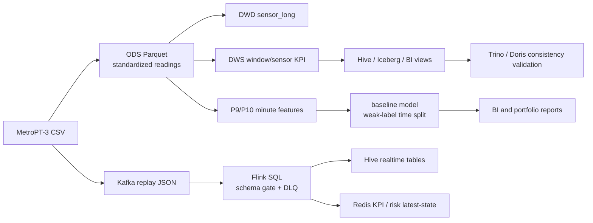

# MetroPT-3 工业设备预测性维护数据平台

语言 / Language: [中文](README_zh.md) | [English](README_en.md)

这是一个围绕 **MetroPT-3 Dataset** 构建的工业设备预测性维护作品集项目。项目把空压机传感器 CSV 数据接入大数据平台，形成离线湖仓、实时回放、风险评分、查询复验、BI 素材和交付包。

项目主线只有一个业务域：`metropt_quality`。

## 数据集来源

本仓库不直接提交 MetroPT-3 原始 CSV/PDF 数据文件。数据集请从官方来源自行下载，并遵守原站点的许可、引用和使用要求：

- UCI Machine Learning Repository: [MetroPT-3 Dataset](https://archive.ics.uci.edu/dataset/791/metropt+3+dataset)

下载后可放置到本地 `datas/` 目录，例如：

```text
datas/MetroPT3_AirCompressor.csv
datas/Data Description_Metro.pdf
```

## 项目做什么

MetroPT-3 数据来自列车空气压缩机 Air Production Unit，包含 2020 年 2 月到 2020 年 8 月的 1Hz 多变量时间序列。项目围绕这些数据完成：

| 能力 | 说明 |
| --- | --- |
| 离线链路 | CSV -> ODS Parquet -> DWD sensor long -> DWS KPI -> Hive/Iceberg -> BI views |
| 实时链路 | CSV replay -> Kafka -> Flink -> Hive realtime tables / Redis KPI |
| 风险评分 | Flink signal-proxy risk scorer 输出 `risk_score`、`risk_level`、`risk_reason` |
| 分析建模 | EDA、弱标签、minute features、baseline model、warehouse-derived feature parity |
| 查询层 | Hive、Trino、Doris 查询样例与 Hive 口径一致性复验 |
| 交付证据 | P7 ops snapshot、P14 master validation、delivery package、中文说明文档 |

当前状态：项目可交付、可演示、可复盘。2026-06-09 当前最新正式 standard P14 复验证据为 `PASS`，汇总为 `pass=18 warn=0 skip=0 fail=0`。

## 先看什么

第一次打开项目，建议按这个顺序阅读：

1. `README_zh.md`：理解项目目标、快速开始和目录入口。
2. `MetroPT-3虚拟机测试执行清单.md`：查看三节点虚拟机集群测试步骤和验收标准。
3. `项目接口文档.md`：查看脚本、数据、Hive/Kafka/Redis/Doris/Trino 接口。
4. `通用大数据流程配置.md`：查看大数据平台基础组件、启动顺序和通用配置。
5. `src/README.md`：理解离线 Spark 链路。
6. `streaming/README.md`：理解 Kafka/Flink/Redis/Hive 实时链路。
7. `analysis/README.md`：理解 EDA、标签、特征、模型和报告。
8. `bin/README.md`：理解每个 `.sh` 验收脚本怎么用、输出在哪里。
9. `data/metropt_quality/README.md`：理解运行结果、logs、reports、figures 和 validation runs。
10. `api/README.md`：查看 FastAPI demo 入口和服务化边界。
11. `tests/README.md`：查看不依赖集群的轻量测试。

## 架构总览



## 快速开始

### 本地轻量阅读

如果只是看代码和文档，不需要启动集群：

```powershell
cd <repo-root>
```

重点查看：

```text
README.md
MetroPT-3虚拟机测试执行清单.md
项目接口文档.md
通用大数据流程配置.md
src/README.md
streaming/README.md
analysis/README.md
bin/README.md
data/metropt_quality/README.md
api/README.md
tests/README.md
```

### 本地分析预检

本地配置文件：

```text
config/metropt_quality.local.yaml
```

本地原始数据：

```text
datas/MetroPT3_AirCompressor.csv
datas/Data Description_Metro.pdf
```

轻量检查命令：

```powershell
python bin/local_code_quality_check.py
python analysis/00_validate_analysis_inputs.py
```

### 集群复现入口

远端项目根目录：

```bash
/home/common/tmp/pycharm_Design
```

集群配置文件：

```bash
/home/common/tmp/pycharm_Design/config/metropt_quality.cluster.yaml
```

进入项目：

```bash
cd /home/common/tmp/pycharm_Design
source /etc/profile.d/bigdata.sh
export METROPT_CONFIG=/home/common/tmp/pycharm_Design/config/metropt_quality.cluster.yaml
```

先跑只读巡检：

```bash
bin/p7_ops_snapshot.sh
```

日常 smoke 检查：

```bash
bin/p10_p9_master_validation.sh --mode smoke
```

正式 standard 复验：

```bash
bin/p10_p9_master_validation.sh \
  --mode standard \
  --allow-swapoff \
  --realtime-max-events 1000 \
  --realtime-wait-seconds 60 \
  --query-timeout 300
```

注意：`smoke` 会显式记录 SKIP，只能说明基础链路大致可用，不能替代 standard 验收。

## 使用示例

### 运行离线链路

完整运行 `00 -> 06`：

```bash
python src/run_metropt_offline.py
```

只跑到 DWS：

```bash
python src/run_metropt_offline.py --stop-after 04_metropt_kpi_calc.py
```

输出目录：

```text
data/metropt_quality/logs/<run_id>/
```

先看：

```text
offline_run_summary.tsv
```

### 运行分析建模

```bash
python analysis/00_validate_analysis_inputs.py
python analysis/run_metropt_analysis.py
```

输出目录：

```text
data/metropt_quality/analysis/reports/
data/metropt_quality/analysis/figures/
data/metropt_quality/analysis/models/
data/metropt_quality/analysis/logs/
```

中文报告文件命名为 `*.zh.md`，英文原文保留不覆盖。

如果只需要解释已有模型产物，不重训模型：

```bash
python analysis/11_model_explainability_summary.py
```

输出：

```text
data/metropt_quality/analysis/models/p11_model_explainability_summary.json
data/metropt_quality/analysis/reports/p11_model_explainability_summary.md
```

### 运行实时回放

先 dry-run 看 JSON 字段：

```bash
python streaming/metropt_replay_to_kafka.py \
  --config /home/common/tmp/pycharm_Design/config/metropt_quality.cluster.yaml \
  --dry-run \
  --print-sample 3 \
  --max-events 3
```

小批量发送 Kafka：

```bash
python streaming/metropt_replay_to_kafka.py \
  --config /home/common/tmp/pycharm_Design/config/metropt_quality.cluster.yaml \
  --rate 500 \
  --batch-size 500 \
  --max-events 10000
```

实时 demo 验收入口：

```bash
bin/p6_realtime_demo_mode.sh --start --duration-minutes 0 --max-events 1000 --rate 500 --wait-seconds 60
```

### 运行查询层复验

```bash
bin/p12_query_layer_validation.sh --allow-swapoff
```

输出目录：

```text
data/metropt_quality/validation_runs/p12_query_layer_validation_<run_id>/
```

重点看：

```text
summary.tsv
p12_query_results.tsv
p12_consistency.tsv
```

### 构建本地小样本和作品集包

生成本地演示小样本，不复制完整原始数据：

```powershell
python bin/build_metropt_sample.py --rows 1000
```

构建精简作品集包：

```powershell
python bin/build_portfolio_package.py
```

该包只复制 README、说明文档、关键报告和演示入口，不复制 raw CSV、Parquet、logs 或服务数据。

### 运行 API demo

先安装依赖：

```powershell
pip install -r requirements.txt
```

再启动：

```powershell
uvicorn api.metropt_portfolio_api:app --host 127.0.0.1 --port 8000
```

这是 portfolio demo，不连接 Redis/Hive/Trino/Doris，也不代表 production serving system。

## 配置说明

| 文件 | 用途 |
| --- | --- |
| `config/metropt_quality.local.yaml` | 本地开发和轻量验证，指向本地 CSV |
| `config/metropt_quality.cluster.yaml` | 三节点集群运行，指向 HDFS、Kafka、Hive、Redis 等 |

核心路径：

| 类型 | 路径 |
| --- | --- |
| Windows 项目根目录 | `<repo-root>` |
| 远端项目根目录 | `/home/common/tmp/pycharm_Design` |
| 本地 CSV | `<repo-root>\datas\MetroPT3_AirCompressor.csv` |
| HDFS CSV | `hdfs:///lakehouse/projects/metropt_quality/raw/MetroPT3_AirCompressor.csv` |
| 验收结果 | `data/metropt_quality/validation_runs/` |
| 交付包 | `data/metropt_quality/delivery_packages/` |

## 文件索引

| 路径 | 作用 |
| --- | --- |
| `src/` | 离线 Spark / Hive / Iceberg 主链路 |
| `streaming/` | Kafka replay、Flink KPI、Flink risk scoring |
| `analysis/` | 数据质量、多维分析、P9/P10 特征和 baseline model |
| `bin/` | 集群启动、巡检、验收、交付脚本 |
| `api/` | FastAPI portfolio demo，展示服务化方向 |
| `tests/` | 不依赖集群的轻量 unittest |
| `data/metropt_quality/` | 运行结果、报告、图表、模型、logs、validation runs、delivery packages |
| `config/` | 本地和集群配置 |
| `Optimize/` | 优化总结和问题排查总结 |
| `MetroPT-3虚拟机测试执行清单.md` | 三节点虚拟机测试执行清单 |
| `通用大数据流程配置.md` | 大数据平台通用配置说明 |
| `项目接口文档.md` | 项目脚本、数据和服务接口说明 |

## 当前关键证据

| 证据 | 路径 | 结论 |
| --- | --- | --- |
| 模型解释性补充 | `data/metropt_quality/analysis/reports/p11_model_explainability_summary.md` | 从已有模型产物解释 feature weights 和指标边界 |
| RUL / anomaly extension plan | `data/metropt_quality/analysis/reports/rul_anomaly_extension_plan.md` | 说明后续 RUL 与 anomaly detection 如何扩展 |
| 当前标准 P14 | `/home/common/tmp/pycharm_Design/data/metropt_quality/validation_runs/p14_master_validation_20260609_020821/` | `PASS`，`pass=18 warn=0 skip=0 fail=0` |
| 当前标准 P14 本地报告 | `data/metropt_quality/analysis/reports/p14_master_validation_report_20260609_020821.zh.md` | 中文摘要和本地归档索引 |
| 历史标准 P14 | `/home/common/tmp/pycharm_Design/data/metropt_quality/validation_runs/p14_master_validation_20260608_050123/` | `PASS_WITH_WARNINGS`，已被 2026-06-09 standard PASS 更新 |
| P12 单独复跑 | `/home/common/tmp/pycharm_Design/data/metropt_quality/validation_runs/p12_query_layer_validation_20260608_043955/` | 全部 PASS |
| smoke P14 | `/home/common/tmp/pycharm_Design/data/metropt_quality/validation_runs/p14_master_validation_20260608_063846/` | `SMOKE_PASS_WITH_WARNINGS_AND_SKIPS` |
| 当前 P7 巡检 | `/home/common/tmp/pycharm_Design/data/metropt_quality/validation_runs/p7_ops_snapshot_20260609_000042/` | `pass=41 warn=0 skip=17 fail=0` |
| 当前 P14 smoke | `/home/common/tmp/pycharm_Design/data/metropt_quality/validation_runs/p14_master_validation_20260609_000132/` | `pass=7 warn=0 skip=8 fail=0`，不能替代 standard |
| 最终交付包 | `data/metropt_quality/delivery_packages/p8_delivery_package_20260606_011332/` | P8 delivery package |

## 常见问题

### `PASS_WITH_WARNINGS` 是失败吗

不是。2026-06-08 的历史 `PASS_WITH_WARNINGS` 指业务链路通过，但 P7 巡检发现资源余量低；该 WARN 是 `hadoop1` 可用内存约 1506 MB / 12%，属于容量风险，不是代码链路失败。当前最新正式 standard P14 是 2026-06-09 的 `PASS`。

### smoke 通过是否等于正式验收通过

不等于。`smoke` 会跳过 P10 特征重建、模型重跑、实时 demo 和查询层复验。正式验收应使用 `standard`，且不能使用 `--skip-*` 冒充完整 PASS。

### Flink 当前没有长作业是否代表实时链路失败

不一定。当前实时链路是短时验证 demo，`current_state=not_running` 且 `overall_status=PASS` 是正常状态。看结果时应以 P1/P6/P11 的 `summary.tsv`、Redis 样例和 Hive 查询为准。

### Trino/Doris 报错先看哪里

先看 `bin/p12_query_layer_validation.sh` 生成的 run_dir：

```text
summary.tsv
p12_query_results.tsv
p12_consistency.tsv
start_*日志
```

不要把旧 P5 查询结果当作 P12/P14 的 P9 查询层证据。
